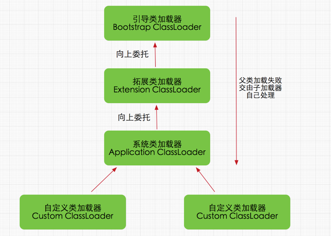
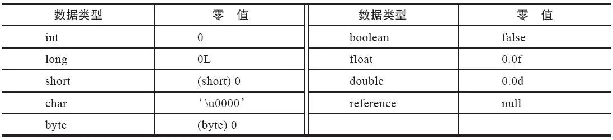

## 类加载
当Java源文件被javac编译后，会生成一个或多个字节码文件（.class文件）。这些字节码文件并不能被直接执行，必须通过Java虚拟机（JVM）来加载和解释执行。类加载是**JVM将类的字节码文件加载到内存**中的过程。

流程大致如下：
1. **加载（Loading）**：JVM通过类加载器（ClassLoader）
2. **连接（Linking）**：包括验证（Verification）、准备（Preparation）和解析（Resolution）三个步骤。
3. **初始化（Initialization）**：执行类的初始化代码，包括静态变量的赋值和静态代码块的执行。

### 加载
以下所有引用内容皆来自《深入理解Java虚拟机（第3版）》
> 加载阶段需要完成以下任务：
> - 通过类的全限定名获取类的二进制字节流。
> - 将这个字节流所代表的静态存储结构转化为方法区的运行时数据结构。
> - 在Java堆中生成一个代表这个类的java.lang.Class对象，作为方法区中类数据的访问入口。
以上三个任务皆由类加载器（ClassLoader）完成。

<p class="img-caption">图片来源：<a href="https://blog.csdn.net/javazejian/article/details/73413292" target="_blank">CSDN博客</a></p>

由于没有限定获取类的二进制字节流的方式，因此Java平台允许开发者自定义类加载器，从而实现从不同的数据源加载类，从中也衍生出了很多举足轻重的技术，例子以下：

#### 运行时计算生成（动态代理）
动态代理技术允许在运行时动态生成类的字节码，并将其加载到JVM中。这种技术广泛应用于AOP（面向切面编程）和RPC（远程过程调用）框架中。Spring 框架（尤其是 Spring AOP）就是动态代理技术的集大成者。
**Spring 是怎么偷天换日的？**
假设你在 Spring 中定义了一个 Bean：

```Java
@Service
public class UserServiceImpl implements UserService {
    @Transactional
    public void addUser() { ... }
}
```
Spring 容器启动时的流程如下：
1. 创建原始对象：Spring 首先像往常一样，实例化 UserServiceImpl。
2. 后置处理 (BeanPostProcessor)：Spring 容器有一个机制叫 BeanPostProcessor。在 Bean 初始化后，Spring 会检查这个 Bean 是否被切面（Aspect）覆盖（比如有没有加 @Transactional 注解）。
3. 决定代理：如果发现需要增强（比如需要开启事务），Spring 就不会直接把原始对象放入容器，而是创建一个代理对象。
4. 生成代理：
   - 如果 UserServiceImpl 实现了接口，Spring 默认使用 JDK 动态代理。
   - 如果它没有实现接口，Spring 会自动切换使用 CGLIB（另一种基于继承的字节码生成技术）。
5. 替换：Spring 把这个生成的代理对象（$ProxyN）放入 IOC 容器（ApplicationContext）中，替换掉原来的 UserServiceImpl。

其中的JDK动态代理使用了Java.lang.reflect.Proxy类。下面是一个简化的示例，展示了JDK动态代理的工作原理：
```Java
// 通用的逻辑，可以应用在任何接口上
public class LogHandler implements InvocationHandler {
    private Object target; // 真正的干活对象

    public LogHandler(Object target) { this.target = target; }

    @Override
    public Object invoke(Object proxy, Method method, Object[] args) throws Throwable {
        System.out.println("动态代理逻辑：开始记录日志...");
        // 反射调用目标对象的方法
        Object result = method.invoke(target, args);
        System.out.println("动态代理逻辑：结束...");
        return result;
    }
}

UserService target = new UserServiceImpl();
// 这一步产生的 proxyInstance，就是 $Proxy0 类的实例
UserService proxyInstance = (UserService) Proxy.newProxyInstance(
    target.getClass().getClassLoader(),
    target.getClass().getInterfaces(),
    new LogHandler(target)
);
```

### 验证
验证阶段的主要任务是确保被加载的类的正确性和安全性。JVM 会检查类的字节码文件是否符合 Java 语言规范，是否没有违反访问权限等。如果验证失败，JVM 会抛出相应的异常，防止不合法的类被加载和执行。
如果所有类都是可信的，那么验证阶段可以省略(通过 -Xverify:none)，从而提高类加载的效率。

### 准备
准备阶段是为类的静态变量分配内存并设置默认初始值的过程。此时的“初始值”**通常情况**是指变量的默认值，而不是程序中定义的初始值。

<p class="img-caption">图片来源：《深入理解Java虚拟机（第3版）》</p>

> 从概念上讲，这些变量所使用的内存都应当在方法区中进行分配，但必须注意到方法区本身是一个逻辑上的区域，在JDK 7及之前，HotSpot使用永久代来实现方法区时，实现是完全符合这种逻辑概念的；而在JDK 8及之后，类变量则会随着Class对象一起存放在Java堆中，这时候“类变量在方法区”就完全是一种对逻辑概念的表述了，

```java
// 通常情况
public static int count = 10;
// 不通常情况，这种情况的初始值就是程序中定义的值
public static final int MAX_COUNT = 100;
```

### 解析
>解析阶段是将类中的符号引用转换为直接引用的过程。

