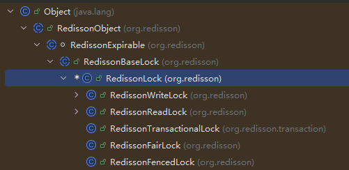

## 实现

### 加锁
基本实现思路是使用SETNX命令来创建一个锁键，并设置一个过期时间以防止死锁。
```bash
set lock_key unique_value NX PX 30000
# 使用SETNX命令尝试设置锁。如果返回值是1，表示获取锁成功；如果返回值是0，表示锁已经被其他进程或线程获取。
```
- NX选项确保只有在键不存在时才设置锁，PX选项设置锁的过期时间为30秒。
- 锁变量需要能够区分不同客户端的加锁操作，因此使用唯一值（如UUID）作为锁的值。

### 解锁
解锁时需要确保只有持有锁的客户端才能释放锁，防止误删其他客户端的锁。
因此，需要两个操作：
1. 获取锁的值，检查是否与当前客户端的唯一值匹配。
2. 如果匹配，则删除锁键。
而这个过程需要是原子操作，可以使用Lua脚本来实现：
```lua
if redis.call("get", KEYS[1]) == ARGV[1] then
    return redis.call("del", KEYS[1])
else
    return 0
end
```

*为什么需要原子操作？*
```md
如果不保持原子性,会出现以下问题:
竞态条件场景:
1. 客户端A检查锁的值,发现匹配
2. 在客户端A删除锁之前,锁过期了
3. 客户端B获取了新锁
4. 客户端A执行删除操作,误删了客户端B的锁
```

### 看门狗机制
在某些情况下,持有锁的客户端可能需要更长时间来完成任务,这时需要实现锁的看门狗机制。
*没有看门狗机制会怎么样？*
```md
1. 拿到锁的客户端处理业务逻辑时间过长,超过锁的过期时间,锁过期被其他客户端获取。
2. 为了避免锁提前释放,可能会设置很长的过期时间(如5分钟),如果此时客户端崩溃,锁会长时间得不到释放,影响其他客户端的正常获取。
看门狗机制**可以动态延长锁的过期时间**,确保只要客户端还在工作,锁就不会过期。除此之外,还**可以将锁的过期时间设置得相对较短**,减少死锁风险。
```
java中通常使用**后台守护进程**来实现
```java
public class RedisLock {
    // Executors.newScheduledThreadPool(1) 创建一个包含1个线程的定时任务线程池
    private ScheduledExecutorService scheduler = Executors.newScheduledThreadPool(1);
    private ScheduledFuture<?> renewalTask;
    
    public boolean lock(String key, String value, long expireTime) {
        Boolean result = redisTemplate.opsForValue()
            .setIfAbsent(key, value, expireTime, TimeUnit.MILLISECONDS);
        
        if (Boolean.TRUE.equals(result)) {
            // 启动续约任务,每隔 expireTime/3 执行一次
            startRenewal(key, value, expireTime);
            return true;
        }
        return false;
    }
    
    private void startRenewal(String key, String value, long expireTime) {
        long renewalInterval = expireTime / 3;
        renewalTask = scheduler.scheduleAtFixedRate(() -> {
            // Lua脚本:检查是否是自己的锁,是则续期
            String script = 
                "if redis.call('get', KEYS[1]) == ARGV[1] then " +
                "    return redis.call('pexpire', KEYS[1], ARGV[2]) " +
                "else return 0 end";
            redisTemplate.execute(new DefaultRedisScript<>(script, Long.class),
                Collections.singletonList(key), 
                value, String.valueOf(expireTime));
          // 初始延迟          执行间隔
        }, renewalInterval, renewalInterval, TimeUnit.MILLISECONDS);
    }
    
    public void unlock(String key, String value) {
        // 停止续约任务
        if (renewalTask != null) {
            renewalTask.cancel(false);
        }
        // 释放锁
        String script = 
            "if redis.call('get', KEYS[1]) == ARGV[1] then " +
            "    return redis.call('del', KEYS[1]) " +
            "else return 0 end";
        redisTemplate.execute(new DefaultRedisScript<>(script, Long.class),
            Collections.singletonList(key), value);
    }
}
```

### 注意事项
以上实现方式适用于**单实例Redis部署**,但在分布式环境下(如Redis Cluster或主从复制),可能会遇到一致性问题。
除此之外,以上实现并未考虑：
- 锁的重入性（可以使用redis的Hash数据结构来实现）
- 获取锁失败的重试机制为实现（若从简可以考虑自旋锁）
- 锁的公平性（在这个场景下,公平性通常不是主要关注点）

## Redisson
现在有很多成熟的分布式锁解决方案,如Redisson,它封装了复杂的逻辑,提供了易用的API。

### 使用
```java
RLock lock = redissonClient.getLock("myLock");
try {
    // 尝试加锁,等待时间为100秒,锁过期时间为10秒
    boolean isLocked = lock.tryLock(100, 10, TimeUnit.SECONDS);
    if (isLocked) {
        // 执行业务逻辑
    }
} catch (InterruptedException e) {
    e.printStackTrace();
} finally {
    // 确保释放锁
    if (lock.isHeldByCurrentThread()) {
        lock.unlock();
    }
}
```

#### getLock()
以上代码中的`getLock("myLock")`为例，表示获取一个名为"myLock"的分布式锁实例。如果该锁不存在，Redisson会自动创建一个新的锁实例。
```java
// ================= Redisson类 ==================
// 在Redisson类中，`getLock`方法的定义如下：
public RLock getLock(String name) {
    return new RedissonLock(commandExecutor, name);
}

// ================== RedissonLock类 ==================
// RedissonLock继承自BaseRedisLock
public RedissonLock(CommandAsyncExecutor commandExecutor,String name) {
    super(commandExecutor, name);
    this.commandExecutor = commandExecutor;
    // 看门狗超时时间,默认30秒
    this.internalLockLeaseTime = getServiceManager().getCfg().getLockWatchdogTimeout();
    // 获取发布订阅服务，基于Redis的Pub/Sub机制实现
    // 该服务每个Redisson实例是唯一的
    this.pubSub = commandExecutor.getConnectionManager().getSubscribeService().getLockPubSub();
}
// 来自RedissonObject类的name属性
String getChannelName() {
    return prefixName("redisson_lock__channel", getRawName());
}

// ================= RedissonObject类 ==================
// RedissonLock的父类BaseRedisLock继承自RedissonObject
public RedissonObject(CommandAsyncExecutor commandExecutor, String name) {
    this(commandExecutor.getServiceManager().getCfg().getCodec(), commandExecutor, name);
}

public final String getRawName() {
    return name;
}
```


#### tryLock()
`tryLock(long waitTime, long leaseTime, TimeUnit unit)`方法尝试获取锁,等待时间为waitTime,锁过期时间为leaseTime。
```java
// ================= RedissonLock类 ==================
@Override
public boolean tryLock(long waitTime, long leaseTime, TimeUnit unit) throws InterruptedException {
    long time = unit.toMillis(waitTime);
    long current = System.currentTimeMillis();
    long threadId = Thread.currentThread().getId();
    Long ttl = tryAcquire(waitTime, leaseTime, unit, threadId);
    // lock acquired
    if (ttl == null) {
        return true;
    }
    
    // ......
}

private Long tryAcquire(long waitTime, long leaseTime, TimeUnit unit, long threadId) {
    // Redisson因为底层基于Netty进行redis通信，为了减少代码重复,只维护了异步方法的实现
    // 异步转同步调用
    return get(tryAcquireAsync0(waitTime, leaseTime, unit, threadId));
}

private RFuture<Long> tryAcquireAsync0(long waitTime, long leaseTime, TimeUnit unit, long threadId) {
    return getServiceManager().execute(() -> tryAcquireAsync(waitTime, leaseTime, unit, threadId));
}

private <T> RFuture<Long> tryAcquireAsync(long waitTime, long leaseTime, TimeUnit unit, long threadId) {
    RFuture<Long> ttlRemainingFuture;
    // 如果leaseTime大于0，使用指定的leaseTime，否则使用默认的internalLockLeaseTime（30秒）
    if (leaseTime > 0) {
        ttlRemainingFuture = tryLockInnerAsync(waitTime, leaseTime, unit, threadId, RedisCommands.EVAL_LONG);
    } else {
        ttlRemainingFuture = tryLockInnerAsync(waitTime, internalLockLeaseTime,
                TimeUnit.MILLISECONDS, threadId, RedisCommands.EVAL_LONG);
    }
    CompletionStage<Long> s = handleNoSync(threadId, ttlRemainingFuture);
    ttlRemainingFuture = new CompletableFutureWrapper<>(s);

    CompletionStage<Long> f = ttlRemainingFuture.thenApply(ttlRemaining -> {
        // lock acquired
        if (ttlRemaining == null) {
            if (leaseTime > 0) {
                // 用户指定了过期时间，更新记录
                // 不启动看门狗
                internalLockLeaseTime = unit.toMillis(leaseTime);
            } else {
                // 没指定过期时间，启动看门狗自动续期
                scheduleExpirationRenewal(threadId);
            }
        }
        return ttlRemaining;
    });
    return new CompletableFutureWrapper<>(f);
}

@Override
public boolean tryLock() {
    return get(tryLockAsync());
}

<T> RFuture<T> tryLockInnerAsync(long waitTime, long leaseTime, TimeUnit unit, long threadId, RedisStrictCommand<T> command) {
    return commandExecutor.syncedEval(getRawName(), LongCodec.INSTANCE, command,
            // KEYS[1]: 锁名称
            // ARGV[1]: 过期时间(毫秒)
            // ARGV[2]: getLockName(threadId)
            
            // 如果锁不存在 或者 当前线程已持有锁(可重入)
            "if ((redis.call('exists', KEYS[1]) == 0) " +
                        "or (redis.call('hexists', KEYS[1], ARGV[2]) == 1)) then " +
                    // Hash计数+1 (首次为1,重入则递增)
                    "redis.call('hincrby', KEYS[1], ARGV[2], 1); " +
                    // 设置过期时间
                    "redis.call('pexpire', KEYS[1], ARGV[1]); " +
                    // 返回nil表示获取锁成功
                    "return nil; " +
                "end; " +
                // 锁被其他线程持有,返回锁的剩余过期时间(毫秒)
                "return redis.call('pttl', KEYS[1]);",
            Collections.singletonList(getRawName()), unit.toMillis(leaseTime), getLockName(threadId));
}
```
**注意事项**
- 如果leaseTime参数小于等于0,Redisson会启动看门狗机制,自动续期锁的过期时间。如果设置了正数leaseTime,则不会启动看门狗,锁会在指定时间后自动过期。

```java
@Override
public boolean tryLock(long waitTime, long leaseTime, TimeUnit unit) throws InterruptedException {
    long time = unit.toMillis(waitTime);
    long current = System.currentTimeMillis();
    long threadId = Thread.currentThread().getId();
    // 初次尝试加锁
    Long ttl = tryAcquire(waitTime, leaseTime, unit, threadId);
    // lock acquired
    if (ttl == null) {
        return true;
    }
    
    // 是否超过了waitTime，如果超时则返回false
    time -= System.currentTimeMillis() - current;
    if (time <= 0) {
        acquireFailed(waitTime, unit, threadId);
        return false;
    }
    
    // 还没超时
    // 订阅锁释放消息
    current = System.currentTimeMillis();
    CompletableFuture<RedissonLockEntry> subscribeFuture = subscribe(threadId);
    try {
        // 等待订阅操作完成（向Redis发送SUBSCRIBE命令）
        subscribeFuture.get(time, TimeUnit.MILLISECONDS);
    } catch (TimeoutException e) {
        if (!subscribeFuture.completeExceptionally(new RedisTimeoutException(
                "Unable to acquire subscription lock after " + time + "ms. " +
                        "Try to increase 'subscriptionsPerConnection' and/or 'subscriptionConnectionPoolSize' parameters."))) {
            subscribeFuture.whenComplete((res, ex) -> {
                if (ex == null) {
                    unsubscribe(res, threadId);
                }
            });
        }
        acquireFailed(waitTime, unit, threadId);
        return false;
    } catch (ExecutionException e) {
        acquireFailed(waitTime, unit, threadId);
        return false;
    }

    // 等待锁释放消息
    try {
        time -= System.currentTimeMillis() - current;
        if (time <= 0) {
            acquireFailed(waitTime, unit, threadId);
            return false;
        }
    
        while (true) {
            // 再次尝试加锁
            long currentTime = System.currentTimeMillis();
            ttl = tryAcquire(waitTime, leaseTime, unit, threadId);
            // lock acquired
            if (ttl == null) {
                return true;
            }

            time -= System.currentTimeMillis() - currentTime;
            if (time <= 0) {
                acquireFailed(waitTime, unit, threadId);
                return false;
            }

            // waiting for message
            currentTime = System.currentTimeMillis();
            // 根据锁的剩余过期时间ttl和剩余等待时间time决定等待时长
            if (ttl >= 0 && ttl < time) {
                commandExecutor.getNow(subscribeFuture).getLatch().tryAcquire(ttl, TimeUnit.MILLISECONDS);
            } else {
                commandExecutor.getNow(subscribeFuture).getLatch().tryAcquire(time, TimeUnit.MILLISECONDS);
            }

            time -= System.currentTimeMillis() - currentTime;
            if (time <= 0) {
                acquireFailed(waitTime, unit, threadId);
                return false;
            }
        }
    } finally {
        unsubscribe(commandExecutor.getNow(subscribeFuture), threadId);
    }
}
```

#### unlock()
```java
// ================= RedissonBaseLock类 ==================
@Override
public void unlock() {
    try {
        get(unlockAsync(Thread.currentThread().getId()));
    } catch (RedisException e) {
        if (e.getCause() instanceof IllegalMonitorStateException) {
            throw (IllegalMonitorStateException) e.getCause();
        } else {
            throw e;
        }
    }
}

@Override
public RFuture<Void> unlockAsync(long threadId) {
    return getServiceManager().execute(() -> unlockAsync0(threadId));
}

private RFuture<Void> unlockAsync0(long threadId) {
    CompletionStage<Boolean> future = unlockInnerAsync(threadId);
    CompletionStage<Void> f = future.handle((opStatus, e) -> {
        cancelExpirationRenewal(threadId);

        if (e != null) {
            if (e instanceof CompletionException) {
                throw (CompletionException) e;
            }
            throw new CompletionException(e);
        }
        if (opStatus == null) {
            IllegalMonitorStateException cause = new IllegalMonitorStateException("attempt to unlock lock, not locked by current thread by node id: "
                    + id + " thread-id: " + threadId);
            throw new CompletionException(cause);
        }

        return null;
    });

    return new CompletableFutureWrapper<>(f);
}

// ================ RedissonLock类 ==================
protected RFuture<Boolean> unlockInnerAsync(long threadId) {
    return evalWriteAsync(getRawName(), LongCodec.INSTANCE, RedisCommands.EVAL_BOOLEAN,
            // KEYS[1]: 锁名称
            // KEYS[2]: 发布订阅频道名称
            // ARGV[1]: 解锁消息(0)
            // ARGV[2]: 锁的过期时间(毫秒)
            // ARGV[3]: getLockName(threadId)
            // ARGV[4]: PUBLISH命令
            
            // 检查锁是否存在且是否是当前线程持有
            "if (redis.call('hexists', KEYS[1], ARGV[3]) == 0) then " +
                    // 锁不存在或不是当前线程持有,返回nil
                    "return nil;" +
                "end; " +
                // 重入计数-1
                "local counter = redis.call('hincrby', KEYS[1], ARGV[3], -1); " +
                // 检查重入次数
                "if (counter > 0) then " +
                    // 还有重入,重置过期时间,返回0(未完全释放)
                    "redis.call('pexpire', KEYS[1], ARGV[2]); " +
                    "return 0; " +
                "else " +
                    // 重入次数为0,删除锁
                    "redis.call('del', KEYS[1]); " +
                    // 发布消息通知等待的客户端
                    "redis.call(ARGV[4], KEYS[2], ARGV[1]); " +
                    // 返回1(完全释放)
                    "return 1; " +
                "end; " +
                "return nil;",
            Arrays.asList(getRawName(), getChannelName()),
            LockPubSub.UNLOCK_MESSAGE, internalLockLeaseTime, getLockName(threadId), getSubscribeService().getPublishCommand());
}
```

### Redis的Pub/Sub机制