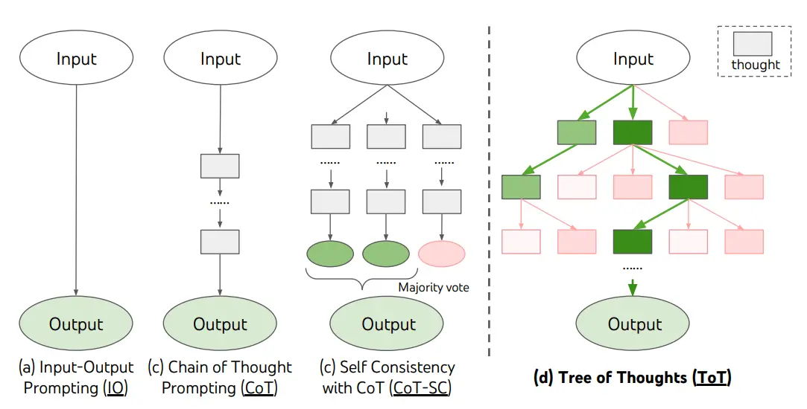

# 提示工程(Prompt Engineering)

## 基本概念
| 概念名称 | 说明 | 备注 |
| -------- | ---- | ---- |
| temperature | 控制生成文本的随机性，值越高，输出越随机。影响概率分布的形状 | 0.0 - 1.0 |
| top_p | 用来控制生成文本的多样性，值越低，输出越集中。影响候选词选取范围 | 0.0 - 1.0 |
| frequency_penalty | 控制生成文本中重复词汇的频率，值越高，重复词汇越少 | -2.0 - 2.0 |
| max_length | 限制生成文本的最大长度，防止输出过长 | 1 - ? |
| prompt | - | 通常使用system、user、assistant角色进行对话式提示设计 |

### 提示
通常大模型的任务可以分为以下几类：
- 文本概括
- 文本分类
- 信息提取
- 对话(Roleplay)
- 问答(Q&A)
- 代码生成
- 推理

#### 零样本提示
即不提供示例，直接给出任务描述，让模型根据提示生成答案。平常直接和ai对话就是零样本提示。

#### 少样本提示
通过提供少量示例，帮助模型理解任务要求，从而生成更准确的答案。

提示：
```text
这太棒了！// Negative
这太糟糕了！// Positive
哇，那部电影太棒了！// Positive
多么可怕的节目！//
```
输出：
```text
Negative
```

少样本提示在大部分任务是非常有效的，但是在代码生成和推理这些复杂任务中，少样本提示则可能无法满足需求。它们更需要的是中间的推理过程（如市面上的深度思考），而不是单纯的输入输出示例。

#### 链式思考（COT）提示
可以通过**少样本COT提示**，引导模型“思考”，前提是语言模型参数足够大
提示：
```text
这组数中的奇数加起来是偶数：4、8、9、15、12、2、1。
A：将所有奇数相加（9、15、1）得到25。答案为False。
这组数中的奇数加起来是偶数：15、32、5、13、82、7、1。
A：
```
输出：
```text
将所有奇数相加（15、5、13、7、1）得到41。答案为False。
```

也能通过**零样本COT提示**来让模型“思考”。
```text
我去市场买了10个苹果。我给了邻居2个苹果和修理工2个苹果。然后我去买了5个苹果并吃了1个。我还剩下多少苹果？
让我们逐步思考。
```
加入“让我们逐步思考”这句话后，模型更容易“推理”出正确答案，而不是直接给出可能错误的答案。

最后还有一种叫**self-consistency**的方法，通过让LLM多次生成COT答案，然后对这些答案进行投票，选出最常见的那个作为最终答案，从而提升准确率。
```python
from langchain.prompts import PromptTemplate
from langchain.llms import OpenAI
from langchain.chains import LLMChain

# 定义 COT prompt
cot_template = PromptTemplate(
    input_variables=["question"],
    template="问题：{question}\n让我们逐步思考。"
)

# 创建链
llm = OpenAI(temperature=0.8)

def self_consistency_chain(question, num_samples=5):
    results = []
    
    for _ in range(num_samples):
        chain = LLMChain(llm=llm, prompt=cot_template)
        result = chain.run(question=question)
        results.append(result)
    
    # 投票
    answers = [extract_answer(r) for r in results]
    return majority_vote(answers)
```

#### 生成知识增强提示
这种提示方法将“知识”结合到prompt，以此降低模型的“幻觉”现象，提高回答的准确性。

提示：
```text
问题：高尔夫球的一部分是试图获得比其他人更高的得分。是或否？
知识：高尔夫球的目标是以最少的杆数打完一组洞。一轮高尔夫球比赛通常包括18个洞。每个洞在标准高尔夫球场上一轮只打一次。每个杆计为一分，总杆数用于确定比赛的获胜者。
回答：
```
输出：
```text
否。
在高尔夫球中，目标是**获得比其他人更低的得分**（即更少的杆数）。
```
这种提示方法“知识”的质量非常重要，“知识”可以通过LLM生成，但是LLM生成的“知识”有时也会包含错误，因此现在更主流的方法是使用**检索增强生成（RAG）**。(详见)

#### 思维树思考（TOT）提示
通过引导模型生成“思维树”，让模型能在推理的考虑更多可能性，并在错误的路径上能及时纠正或放弃。TOT通常是BFS风格的思考方式，而COT是DFS风格的思考方式。

Hulbert (2023) 提出了思维树（ToT）提示法，将 ToT 框架的主要概念概括成了一段简短的提示词，指导 LLM 在一次提示中对中间思维做出评估。ToT 提示词的例子如下：
```text
假设三位不同的专家来回答这个问题。
所有专家都写下他们思考这个问题的第一个步骤，然后与大家分享。
然后，所有专家都写下他们思考的下一个步骤并分享。
以此类推，直到所有专家写完他们思考的所有步骤。
只要大家发现有专家的步骤出错了，就让这位专家离开。
请问...
```


<p class="img-caption">各种思维的示意图(图片来源：<a href="https://arxiv.org/abs/2305.10601" target="_blank">Hulbert</a>)</p>

### ReAct框架
ReAct框架提供了一套通用的范式来构建智能体，帮助LLM能不局限于单纯的“思考”，而是能结合“行动”来完成复杂任务。让LLM能边实践边思考，思考后再实践。

ReAct的流程通常如下：
1. <Thought>：模型根据当前信息进行思考，决定下一步行动。
2. <Action(optional)>：模型选择一个工具（Tool）并提供相应的输入
3. <Observation(optional)>：工具执行后返回的结果
4. 重复上述步骤，直到任务完成。

```text
你是一个可以使用工具的智能助手。
可用工具：
{tools}

请使用以下格式回答：
Thought: 思考下一步该做什么
Action: 工具名称[输入]
Observation: 工具返回的结果
...（根据需要重复）
当你知道答案时：
Action: Finish[最终答案]

问题：{question}
Thought:
```

但是ReAct并不总是优于COT，它仅旨在解决COT的事实幻觉问题，在某些需要复杂推理的任务中，COT可能表现更好。
>结合并支持在 ReAct 和链式思考+自我一致性之间切换的提示方法通常优于所有其他提示方法。

在langchain中，ReAct框架已经被很好地实现了，用户只需要定义好工具（Tool），然后使用Agent就能轻松使用ReAct框架。
```python
# 引入库
import openai
import os
from langchain.llms import OpenAI
from langchain.agents import load_tools
from langchain.agents import initialize_agent
from dotenv import load_dotenv
load_dotenv()
 
# 载入 API keys 
os.environ["OPENAI_API_KEY"] = os.getenv("OPENAI_API_KEY")
os.environ["SERPER_API_KEY"] = os.getenv("SERPER_API_KEY")

llm = OpenAI(model_name="text-davinci-003" ,temperature=0)
tools = load_tools(["google-serper", "llm-math"], llm=llm)
agent = initialize_agent(tools, llm, agent="zero-shot-react-description", verbose=True)

agent.run("奥利维亚·王尔德的男朋友是谁?他现在的年龄的0.23次方是多少?")
```

