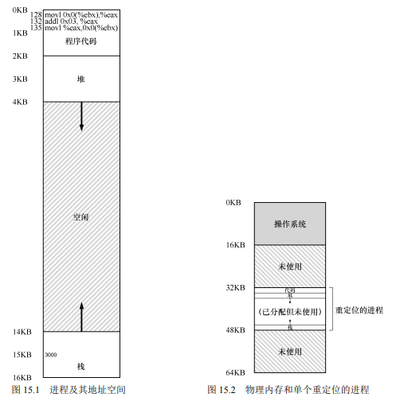
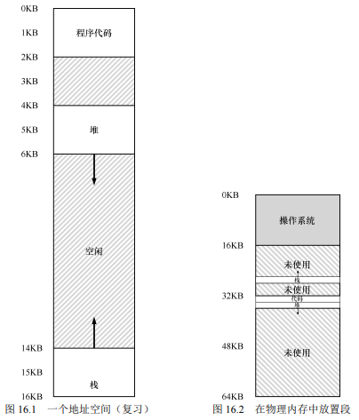
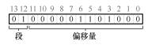
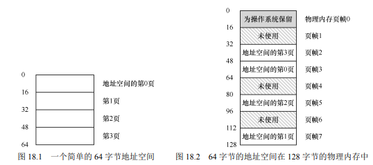
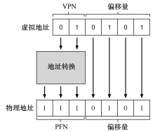
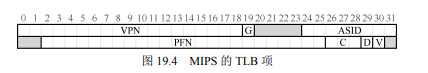
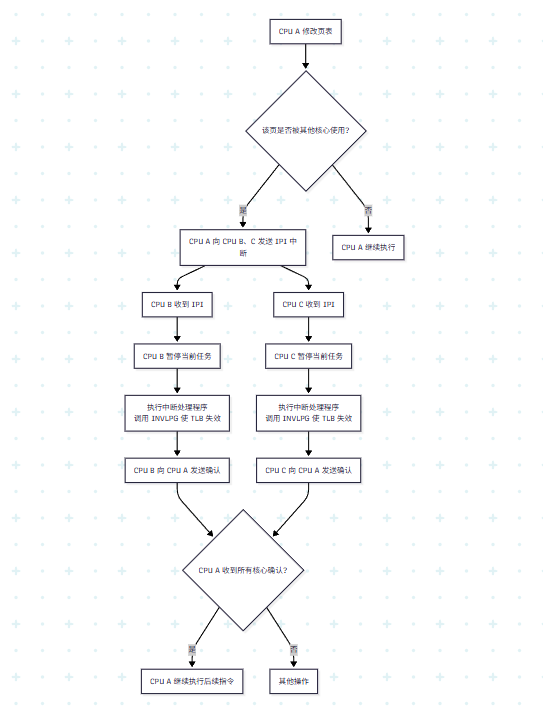
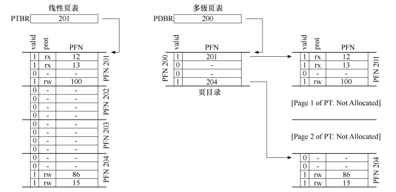
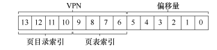

# 课程简介
6.S081是麻省理工学院（MIT）开设的一门操作系统课程，课程内容涵盖了操作系统的基本原理和设计方法。课程由MIT的教授和研究人员讲授，内容包括进程管理、内存管理、文件系统、输入输出系统等。

# 学习笔记
笔记内容主要参考课程以及《操作系统导论-OSTEP》整理。

## 虚拟内存
虚拟内存作为一种内存管理技术，核心作用可以总结为以下几点：
- 扩充内存容量
- 内存隔离与保护
- 简化内存管理
- 提高内存利用率

### 地址转换
在虚拟内存出现之前，程序使用的是物理地址。引入虚拟内存之后，程序使用虚拟地址，怎么将这个虚拟地址转换为物理地址成了一个重要的问题。
我们考虑以下情况：

程序执行时地址空间示意图

对于程序来说他的地址空间从0开始到16KB结束，但是实际被重定位到32KB到48KB之间。我们可以很简单地想到引入一个**基址寄存器**，用来存储重定位的起始地址32KB。那么每次程序访问地址时，只需要将虚拟地址加上基址寄存器的值就可以得到物理地址了。除此之外，我们还要引入一个**界限寄存器**来确保程序不会访问到不属于自己的内存空间。

至此我们已经实现了最简单的地址转换机制，这种机制简单，但是很好的**解决了内存保护的问题**。但是，它有效率低下的问题。例如从上图可以看到，由于程序的栈区和堆区不是很大，所以有很多内存空间是没有被使用的，造成了大量空间被浪费。这种浪费通常被称为**内部碎片**。

### 分段机制
为了解决上述问题，我们可以将程序的地址空间划分为多个段（Segment），每个段有自己的基址和界限寄存器。这样程序在访问内存时，首先确定要访问的是哪个段，然后使用该段的基址和界限寄存器进行地址转换。以上的想法即是**分段机制**。

分段机制下，程序执行时地址空间示意图

分段之后我们不再需要一个大的连续内存空间来存放整个程序，而是可以将不同的段放在内存的不同位置，从而提高了内存的利用率。但是我们需要知道，地址是怎么被转换的：

#### 显式方法
当硬件在进行地址转换时，会使用对应的段寄存器，要想知道地址引用的段以及段内的便宜量，我们可以将虚拟地址划分为两部分：高位部分表示段号，低位部分表示段内偏移量。硬件通过段号找到对应的段表项，从而获取该段的基址和界限寄存器，然后将偏移量加上基址得到物理地址。

显式方法

#### 隐式方法
硬件还有其他方法来决定特定地址在哪个段。在隐式方式中，硬件通过地址产生的方式来确定段。例如，如果地址由程序计数器产生(即它是指令获取)，那么地址在代码段。如果基于栈或基址指针，它一定在栈段。其他地址则在堆段。

#### 更加细粒度的分段
以上方法适用于粗粒度的分段（比如将一个程序的地址空间分成代码、堆和栈三段），对于更加细粒度的分段则需要用到段表（因为我们不可能继续为每个段提供一对基址+界限寄存器），这于接下来要提到的页表很像。

分段机制进一步**提高了内存的利用率**，并且仍然保持了内存保护的功能。然而，分段机制仍然存在一些问题，例如段的大小不固定，可能会导致**外部碎片**的问题。

对于这些问题，我们可以考虑**紧凑物理内存**，即通过移动内存中的段来消除碎片，重新安排内存空间来清除外部碎片。然而，这种方法需要暂停所有进程，移动内存中的数据，效率较低。或者我们可以引入**空闲列表管理算法**来管理内存空间，记录哪些内存块是空闲的，哪些是已分配的，从而更有效地分配内存。

### 分页机制
分页机制相比以前的方法，最大的改进便是灵活性：操作系统能够高效地提供地址空间的抽象，不管进程如何使用地址空间；同时分页通过将空间分割成固定长度的分片，只要这个固定长度设定合理，就不会有很大的连续空间被浪费。

分页机制下，程序执行时地址空间示意图

为了记录地址空间的每个虚拟页放在物理内存中的位置，操作系统通常为每个进程保存一个数据结构，称为页表，它是作为每一个进程的数据结构之一来存放。
加入某一个进程的虚拟地址空间是64B，页大小是16B，那么一共会有4个页，因此需要2位的虚拟页号（VPN），虚拟地址的其余位则作为偏移量来告诉我们程序需要该页的哪些字节信息。
接着内存管理单元（MMU）进行地址转换时，会使用虚拟页号作为索引来查找页表，从而获取对应的物理页框号，然后将偏移量加上物理页框的起始地址，得到最终的物理地址。

分页机制下地址转换示意图

分页机制**彻底解决了内存碎片的问题**，提高了内存的利用率。然而，分页机制也存在一些问题，例如页表可能会非常大，导致内存开销增加。此外，频繁的页表查找可能会影响性能。为了解决这些问题，可以引入**多级页表**和**快表（TLB）**等技术来优化页表的管理和访问速度。

#### 页表表项
页表的每个表项除了记录物理页号（PFN）外，还包含一些控制位，比如：
- 存在位（Present Bit）：表示该页是在物理存储器还是在磁盘上，这也解释了现代电脑为什么能够运行大于物理内存的程序。因为操作系统会将不常用的页换出到磁盘上，从而腾出物理内存给其他程序使用。
- 有效位（Valid Bit）：表示该页是否被分配给进程。如果进程访问了一个无效页，操作系统会触发一个异常，通常称为“段错误”。
- 参考位（Referenced Bit）：表示该页最近是否被访问过。操作系统可以使用这个信息来决定哪些页应该被换出。
等等。

#### TLB
页表对速度的拖累是显而易见的，原本我们只需要直接查找内存地址就可以了，现在却需要多一步查找页表的过程，这无疑增加了内存访问的时间。为了解决这个问题，现代处理器引入了一种称为**快表（Translation Lookaside Buffer, TLB）**的缓存机制。

每当一个东西访问起来很慢，我们总会想在其中间插入一个更快的中间件，TLB就是这样一个中间件。它对速度的提升相信了解过cache的人都不会陌生。此处不再赘述TLB的工作原理。

##### TLB表项
以下是稍微简化的 MIPS TLB 项。

MIPS TLB 表项示意图

VPN、PFN则不赘述，下面介绍其他位：
- 全局位（Global Bit）：如果设置了这个位，那么该页对于所有进程都是可见的。这样可以避免在上下文切换时刷新 TLB，从而提高性能。通常用于内核代码和数据。
- 脏位（Dirty Bit）：表示该页是否被写过。如果一个页被修改过，那么在将其换出到磁盘之前，操作系统需要将其写回磁盘，以确保数据的一致性。

##### TLB需要注意的问题
1. 谁来处理TLB未命中？
   通常情况下，TLB未命中会触发一个硬件异常，由操作系统的内核来处理。发生 TLB 未命中时，硬件系统会抛出一个异常，暂停当前的指令流，将特权级提升至内核模式，跳转至陷阱处理程序，内核会查找页表，找到对应的页表项，然后将其加载到TLB中，以便下次访问时能够更快地找到。
   这里的陷阱处理需要区别于服务于系统调用的陷阱处理程序，以下是书中的描述：
   >首先，这里的从陷阱返回指令稍稍不同于之前提到的服务于系统调用的从陷阱返回。在后一种情况下，从陷阱返回应该继续执行陷入操作系统之后那条指令，就像从函数调用返回后，会继续执行此次调用之后的语句。在前一种情况下，在从 TLB 未命中的陷阱返回后，硬件必须从导致陷阱的指令继续执行。这次重试因此导致该指令再次执行，但这次会命中 TLB。因此，根据陷阱或异常的原因，系统在陷入内核时必须保存不同的程序计数器，以便将来能够正确地继续执行。
2. TLB一致性问题
   如果是**单核环境**下，TLB一致性问题并不严重，因为只有一个处理器在运行，TLB中的内容只会被当前处理器使用，不会出现多个处理器之间的冲突。我们可以简单通过在修改页表后立即刷新TLB来确保一致性。刷新可以是全量刷新，也可以是针对特定页的刷新，具体取决于硬件支持的功能。
   如果是**多核环境**下，TLB一致性问题就变得复杂了。因为多个处理器可能会同时运行同一个进程的不同线程，每个处理器都有自己的TLB缓存。如果一个处理器修改了页表，其他处理器的TLB可能仍然缓存着旧的共享页表项，导致地址转换错误。为了解决这个问题，操作系统通常会使用一种称为**TLB Shootdown**的机制。TLB 射击（TLB Shootdown） 的标准流程如下：
   
3. 上下文切换时的TLB管理
    当操作系统进行上下文切换时，通常会切换到另一个进程的地址空间。由于每个进程都有自己的页表和TLB缓存，因此在切换时需要确保TLB中的内容与当前进程的页表一致。常见的做法是，在上下文切换时，操作系统会刷新TLB，以确保新的进程能够正确地进行地址转换。某些高级处理器支持**地址空间标识符（ASID）**，允许多个进程共享同一个TLB，而不需要在每次上下文切换时刷新整个TLB，从而提高了性能。
  
#### 多级分页
多级页表的思想很简单，我们原先使用一个线性页表来映射虚拟页号（VPN）到物理页框号（PFN），但是这个线性页表并不是全被占用，可能会有一部分被置为无效，但是我们仍需要保存这个页表的全部信息，这就造成了内存的浪费。为了解决这个问题，我们可以将页表划分为多个层次，每一层页表只保存部分映射关系，从而减少内存的使用。

线性（左）和多级（右）页表

在上图中，我们通过多查询一次的代价来节省内存空间，还增加了复杂度，但是为了宝贵的内存空间，这个代价是值得的。

引入多级分页后，虚拟地址的解读变成如下：

现在我们要查地址需要先查找第一级页表，找到对应的第二级页表，然后再找到物理页框号。

#### 页表交换
对于页表，我们已经谈论了很多相关的优化技术，但是我们还没有讨论一个重要的问题：虚拟内存是怎么能做到比物理内存还要大的？为了达到这个目的，操作系统需要将不常用的页表项换出到磁盘上，从而腾出物理内存给其他程序使用。这种技术称为**页表交换（Swapping）**。
或许你还能记起之前提及的存在位（Present Bit），该位正是用来标识页表项是否在物理内存中的。

接下来我们可以很容易地推理出页表交换的工作流程：
1. 当一个进程访问一个页时，操作系统首先检查该页的存在位。
2. 如果存在位为1，表示该页在物理内存中，操作系统可以直接进行地址转换。
3. 如果存在位为0，表示该页不在物理内存中，操作系统会进行相应的处理，通常称为**缺页异常（Page Fault）**。

现在我们遇到了第一个问题，缺页异常如何处理？
1. 操作系统暂停当前进程的执行，保存其状态。
2. 查找页表，找到对应的页表项，确定该页在磁盘上的位置。
3. 将该页从磁盘加载到物理内存中。如果物理内存已满，操作系统需要选择一个页进行换出（通常使用某种页面置换算法，如LRU、FIFO等）。
4. 更新页表项，设置存在位为1，并将物理页框号更新为新加载的页的物理地址。
5. 恢复进程的执行状态，重新执行导致缺页异常的指令。

如果物理内存已满，操作系统需要选择一个页进行换出怎么办？
1. 选择一个页进行换出，通常使用某种页面置换算法，如LRU、FIFO等。
2. 检查该页的脏位（Dirty Bit）。如果脏位为1，表示该页被修改过，操作系统需要将其写回磁盘，以确保数据的一致性。
3. 更新页表项，设置存在位为0，并将该页的物理页框号更新为磁盘上的位置。
4. 将新页加载到物理内存中，更新相应的页表项。

